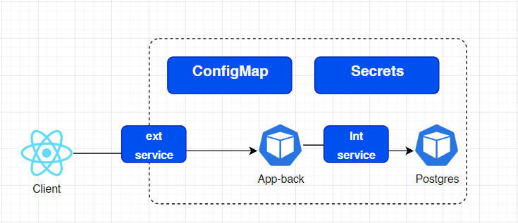

# Todo on steroids
Simple todo app using K8s, spring and react

## K8s commands
```shell
kubectl apply -f ./configmap.yaml
kubectl apply -f ./secret.yaml
kubectl apply -f ./service.yaml
kubectl apply -f ./deployment.yaml
```
## Structure
- The front of the application is outside of the cluster
  
